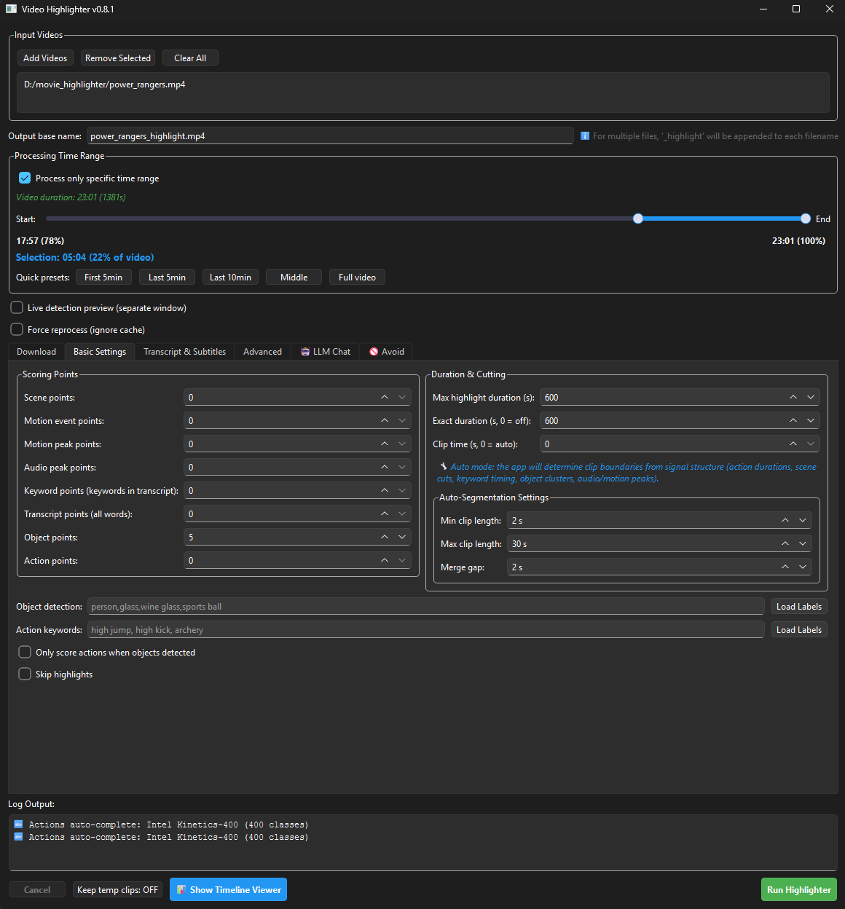
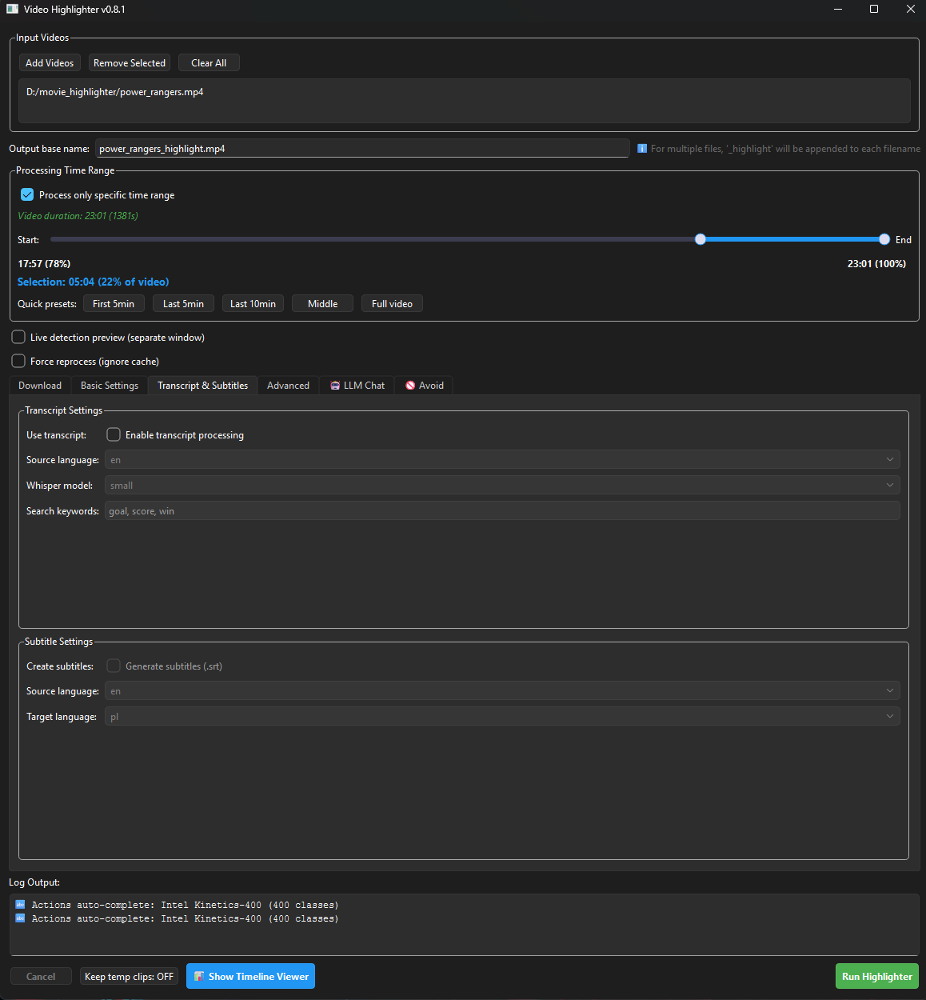
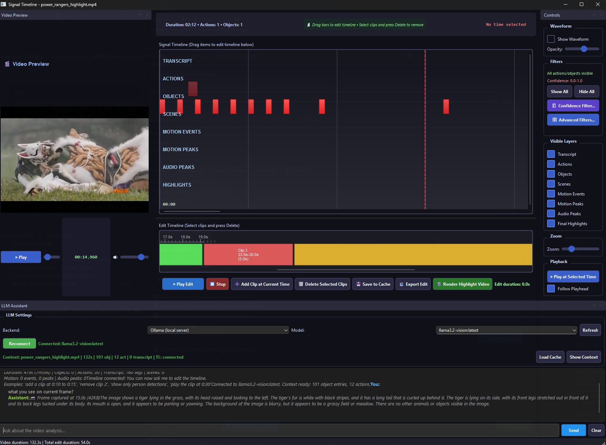
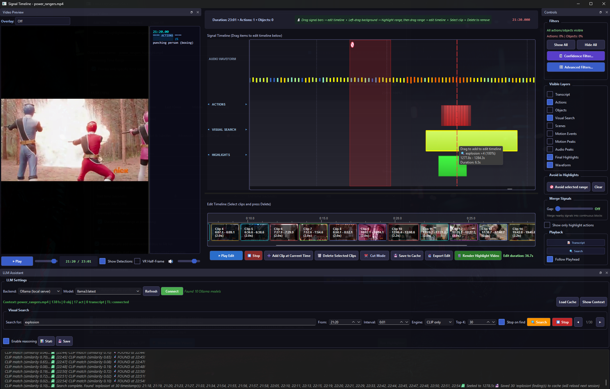
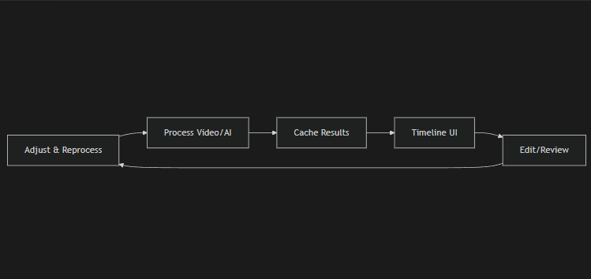
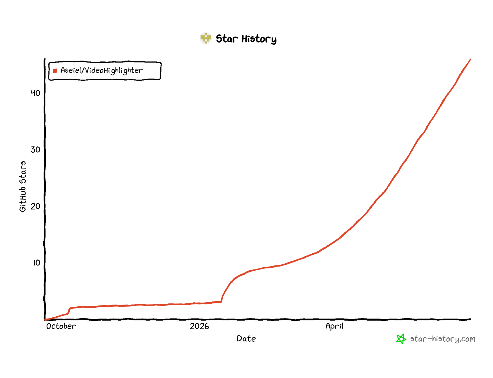

VideoHighlighter (Freeware)

A Python tool to automatically generate highlight clips from videos using scene detection, motion detection, audio peaks, object detection, action recognition, and transcript analysis.

Features

Detects:
- Scenes using OpenCV.
- Motion peaks and scene changes.
- Objects
- Actions
- Audio peaks.

Generates transcript subtitles via OpenAI Whisper.
Cuts and merges top scoring segments into a highlight video.
Fully configurable: frame skip, highlight duration, keywords.
Optional GUI for easy interaction.

## Preview

## Timeline Viewer

## Visual Search

## Action Recognition

## Workflow Stages

## Installation

### Windows (recommended)
Download the latest `.exe` from [Releases](link) — no Python or dependencies required.

### Linux / Building from Source
1. **Python & FFmpeg**
   FFmpeg must be installed and available in your system PATH.

## Usage
Linux: python main.py 
Windows: run Videohighlighter.exe
Mac: I think not working, will fix it one day. DMG file is still generated

## Discord
VideoHighlighter occasionally has feelings about your footage. When it does:
[Join the Discord](https://discord.gg/cUPJqPAMmm) and yell in #support, I'm usually around.

## Notes

OpenAI Whisper is MIT licensed — freely usable.

Google Translate API is optional. If using unofficial libraries (googletrans), no API key is needed, but results may break if Google changes endpoints.

This project does not include any paid API keys. Users must provide their own if using official services.

## License

This repository is released under the GNU Affero General Public License v3.0 (AGPLv3). You are free to use, modify, and distribute the code, provided that any modified versions, including those offered over a network, make their complete source code available under the same license.

## Project Background

This project started as a personal tool to automatically generate subtitles for videos, for my young 7 years old son. Over time, it evolved into a highlights generator for movies, sports, and personal videos.

The primary goal remains practical: speed up video analysis, generate highlights, and create accessible subtitles automatically.

