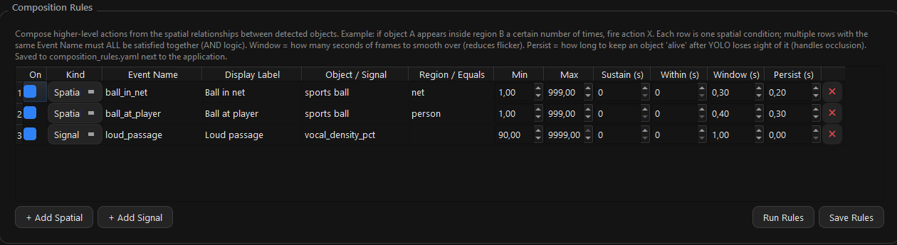

<p align="center">
  
</p>

# VideoHighlighter

<!-- hy-mt2-i18n:start -->
**English** | [中文](./README_zh-CN.md) | [日本語](./README_ja.md) | [Español](./README_es.md)
<!-- hy-mt2-i18n:end -->

**Find and explain the moments that matter in footage you won't upload — then export a cut, on your machine.**

A local desktop tool: drop raw video, score strong moments (scene, motion, audio, objects, actions, transcript), see *why* they scored on a signal timeline and report, then export a highlight reel and separate clips. Nothing is uploaded for analysis.

Two things separate it from the rest of the "AI highlights" shelf:

- **[Every run explains itself](#why-these-moments)** — the report is the
  arithmetic behind each kept moment, and it names the claims that came from
  the transcript and were never measured instead of scoring them anyway.
- **[Composition rules](#composition-rules)** — you say what a *combination* of
  detections means for your footage, and because a rule re-reads detections
  that already exist, editing one and re-running costs milliseconds.

> **It's free.** To make sure you see new releases in future, please click the
> motivation button: the ⭐ at the top of the page. It's the cheapest payment we
> accept.


Features

Detects:
- Scenes using OpenCV.
- Motion peaks and scene changes.
- Objects
- Actions
- Audio peaks.

Generates transcript subtitles via OpenAI Whisper (local).
Cuts and merges top scoring segments into a highlight video, and optionally
writes each one out as a separate clip beside the reel.
Combines many clips into a single reel, with an optional music bed
(replace / mix / duck) and correct handling of rotated (phone / GoPro) footage.
Optionally penalizes blurry clips so sharp moments win.
Fully configurable: frame skip, highlight duration, keywords.

Two front ends over one engine:
- **Qt desktop GUI** (`main.py`) — the original, with the full Timeline Viewer.
- **Web app** (`frontend/` + `sidecar/`) — a Tauri v2 shell around a React UI,
  with the Python engine running behind it as a FastAPI sidecar. Adds
  folder-at-once input, the reel + music controls, and the blur gate. See
  [`frontend/README.md`](frontend/README.md). It still launches the Qt window
  for the Timeline Viewer.

## Card to film

The **Auto** tab runs the whole thing as one resumable job: find the camera
card, copy it off, find the highlights, build the reel, lay the music.

- **Ingest** — cards are found by layout, not drive letter, and GoPro's
  chapter-before-file-number naming is sorted back into recording order (the
  reason a plain listing interleaves separate takes). Copies verify before they
  land, so an interrupted transfer can't leave a short file that looks whole.
  Re-running copies nothing. Nothing is deleted from the card.
- **Script** — a YAML file saying what the film should contain, beat by beat,
  so a run can express intent instead of just "the highest-scoring seconds".
  Unknown keys are refused with a line number and a suggestion rather than
  silently ignored.
- **Music** — beats, downbeats, tempo and energy sections, on numpy and ffmpeg
  alone. Cuts can then land on the beat rather than near it.
- **Resume** — every stage records what it produced and a re-run skips whatever
  is still on disk, because the expensive middle is exactly what gets
  interrupted.

Full detail: [docs/AUTO-PIPELINE.md](docs/AUTO-PIPELINE.md).

Not sure which detector to reach for? See
[docs/DETECTION-GUIDE.md](docs/DETECTION-GUIDE.md) — what object recognition,
action recognition, CLIP search and the composition engine are each good at,
and where each one falls down.

> **Want real-time detection?** Everything above runs offline, after the fact.
> [VideoHighlighter Pro](#pro-edition) adds live object and action overlays
> during playback, teach-by-example categories, open-vocabulary detection and
> counter detection. [See what's different →](#pro-edition)


## Preview


## Timeline Viewer


## Demo

https://github.com/user-attachments/assets/5c85af94-9228-4537-926a-1ed7a91fa5ee

## Workflow Stages


## Why these moments

Every run writes a report next to the highlight — one self-contained HTML file
you can open or email. Nothing is fetched when it loads; the thumbnails are
embedded.

It is not a summary. It is the arithmetic: for each moment kept, the per-signal
point breakdown, which objects and actions fired, the confidence tier each one
landed in, and whether the multi-signal boost applied. Around that sit the clips
in cut order, the video in chapters, the moments that scored well and still did
not make it, and the exact settings the run used.

Three sections earn it its keep:

- **Said here, measured nowhere** — lines from the transcript that no class or
  event this run produced shares a word with. The report quotes them and states
  that it has no measurement for them, rather than quietly scoring them as
  though it did.
- **What to try next** — worked out from that run's own numbers, each point
  backed by the figures shown beside it rather than by a guess about what you
  meant. It reads like this:

  > **The highlight came out shorter than you asked for.** You asked for up to
  > 46s and got 30s. In MAX mode the cut stops when it runs out of moments that
  > scored anything at all — not when it runs out of budget. *Try:* lower the
  > detector thresholds so more moments score, give another signal a weight, or
  > accept the shorter cut — padding it means including moments nothing was
  > detected in.

- **In closing** — what the run observed, what was only asserted and by whom,
  and what it could not determine, kept apart, because running them together is
  how the third quietly becomes the first:


Detections are the run's own observations. A transcript is one speaker's
account, and may describe things that never appear in the frame — so it is
attributed, not merged in. And the limits are listed rather than left to
silence, because a report that stops at what it found invites its gaps to be
read as absence. A model writes the chapter prose, but every boundary and figure
it is handed was computed before it saw them.

A whole report, unedited:
**[open the example](https://aseiel.github.io/VideoHighlighter-site/example-report.html)**
— 6 clips out of a minute of footage. The file itself is in the repo at
[`docs/examples/escalated_highlight_why.html`](docs/examples/escalated_highlight_why.html);
its six inline players stay empty there unless the source video sits beside it.

Explanation is never a paid feature. The report, the findings and the advisor
are identical in both editions. A cloud tool gives you a button and a result you
cannot interrogate; answering "why", locally, is what this is instead.

## Composition rules

The detectors report what is on screen. A composition rule says what a
*combination* of those readings means for your footage, and scores it.

A rule names the signals it tests and the window it tests them over. Available
signals include the per-second audio and vocal measurements (`audio_level`,
`vocal_effort`, `vocal_density`), scene and motion events, and any class the
detectors produced. A match becomes an event under a name you choose, and that
name then appears in the report like any other signal.

**This is how you get an event the models have no word for.** Action
recognition answers from a fixed list of 400 classes: ask it about anything
outside that list and it returns the nearest thing inside it, with the
confidence you would expect from a wrong answer. A rule is not limited that
way. It describes a relation between detections — one class inside another,
counted, holding steady over a window — so the event is whatever that relation
means in your footage, under the name you gave it.

A goal, for instance, is a ball whose centre is inside the net:

```yaml
events:
  - name: ball_in_net
    label: Ball in net
    window_secs: 0.3        # it is only in there briefly — smooth less
    persist_secs: 0.2
    rules:
      - {source: sports ball, region: net, min_count: 1}
```

The same rules in the app, where they are edited and run:



`sports ball` is one of the 80 classes the stock detector already knows. The
net is not, so that single class is what you label and train — one primitive,
reusable, rather than a "goal" class the network would have to infer from
pixels that do not contain the distinction. The rule supplies the meaning. See
`docs/DETECTION-GUIDE.md` on training primitives instead of categories.

**There is no "how far in" setting, and that is the point.** The test is
whether the ball's *centre* falls inside the box, so how deep it has to be is
decided when you label the net, not by a threshold here: label the mouth and a
ball on the line fires it, label the space behind the line and only a ball that
has fully crossed does. The depth lives in the training data, where you can see
it, rather than in a number you would tune blind.

The confidence follows from that. A composed event is only as sure as the
weakest detection it matched, so it carries *detector* confidence rather than a
classifier's guess at a class it was never taught. In the rule above, a ball
found at 0.91 inside a net found at 0.87 scores 0.87 — and 80–100% is the
ordinary case, for moments an action label would score far lower and often name
wrongly.

Composed events get their own rows on the timeline, directly under the
waveform, one row per rule that actually fired, filterable separately from
objects and actions.

Rules live in `composition_rules.yaml` in your user data folder — beside the
executable on Windows, `~/Library/Application Support/VideoHighlighter` on
macOS, the project root when running from source. Nothing ships with a rule
set, and the file is gitignored, so the events you define stay on your machine.
With no file present the engine is skipped entirely.

They run on **every** pass, over whatever detections are already to hand — a
rule is a reading of boxes that already exist, not a second detection. So
editing one and re-running costs milliseconds and never invalidates the cache.
The loop is: change a threshold, re-run, read the report, change it again.

## Pro edition

**VideoHighlighter — this repository — is free software under AGPL-3.0**, and
stays that way. It already includes live face detection, VR side-by-side
playback and rendering, offline analysis, CLIP search, the composition engine,
and the training scripts.

**[VideoHighlighter Pro](https://aseiel.github.io/VideoHighlighter-site/) is a
separate paid, closed-source edition.** On top of everything above, it adds:

- **Live object and action overlays** — real-time detection during playback,
  including on side-by-side VR footage.
- **Teach a category by pointing** — draw a box around anything, name it, and
  it is scored live from then on. No dataset, no training run.
- **Find more like this** — pick a region in one frame and search the whole
  video for it.
- **Open-vocabulary detection** — type a plain word and find it, with no
  trained model for it.
- **Counter / scoreboard detection** — if the footage has an on-screen counter,
  every tick proves an event, so Pro can show which real moments the detector
  missed.

Explanation is not among them: the report, the findings and the advisor are
identical in both editions.

## Installation

### Windows (recommended)
1. **One-click:** download [`VideoHighlighter-Windows-Setup.zip`](https://github.com/Aseiel/VideoHighlighter/releases/latest/download/VideoHighlighter-Windows-Setup.zip) from [Releases](https://github.com/Aseiel/VideoHighlighter/releases), extract it, and double-click **`Install-VideoHighlighter.bat`**. It downloads both archive parts and unpacks them (~4 GB download).
2. **Manual:** download **both** `VideoHighlighter-Windows-*.7z.001` and `.7z.002` into the same folder, then extract the `.001` file with [7-Zip](https://www.7-zip.org/).

No Python or dependencies required — run `VideoHighlighter.exe` inside the extracted folder.

### macOS
Download the `.dmg` from [Releases](https://github.com/Aseiel/VideoHighlighter/releases)
and drag **VideoHighlighter** into Applications.

The app is ad-hoc signed and **not notarised**, so macOS quarantines it and the
first launch fails — usually as *"VideoHighlighter is damaged and can't be
opened"*. Nothing is damaged: that is Gatekeeper reacting to the missing
notarisation, and it says the same thing about a perfectly good download. Clear
the quarantine flag once, in Terminal:

```bash
xattr -dr com.apple.quarantine /Applications/VideoHighlighter.app
```

Then open it normally. Repeat it after each update, since the flag comes back
with the new download.

Mac builds get far less testing than Windows — please [open an
issue](https://github.com/Aseiel/VideoHighlighter/issues) when something breaks.

### Linux / building from source
1. **Python & FFmpeg**
   FFmpeg must be installed and available in your system PATH.

## Usage
- **Windows:** run `VideoHighlighter.exe` from the extracted build.
- **macOS:** open **VideoHighlighter** from Applications, after clearing the
  quarantine flag above.
- **From source (Linux / advanced):** `python main.py`

Footage, transcripts, and local models stay on disk. Analysis does not require
an API key for the basic pipeline.

## Discord
VideoHighlighter occasionally has feelings about your footage. When it does:
[Join the Discord](https://discord.gg/cUPJqPAMmm) and yell in #support, I'm usually around.


## Notes

OpenAI Whisper is MIT licensed — freely usable.

Google Translate API is optional. If using unofficial libraries (googletrans), no API key is needed, but results may break if Google changes endpoints.

This project does not include any paid API keys. Users must provide their own if using official services.


## License

Copyright (C) 2026 Przemysław Kreft and Meric Donmezer.

This repository is released under the GNU Affero General Public License v3.0 (AGPLv3). You are free to use, modify, and distribute the code, provided that any modified versions, including those offered over a network, make their complete source code available under the same license. The full text is in [LICENSE](LICENSE); the copyright notice is in [COPYRIGHT](COPYRIGHT).

Contributors keep copyright in their own work — see [CONTRIBUTING.md](CONTRIBUTING.md) and [CLA.md](CLA.md). VideoHighlighter is also offered under a separate commercial license by the copyright holders.


## Project Background

This project started as a personal tool to automatically generate subtitles for videos, for my young 7 years old son. Over time, it evolved into a highlights generator for movies, sports, and personal videos.

The primary goal remains practical: speed up video analysis, generate highlights you can explain, and create accessible subtitles automatically — without uploading footage you would rather keep local.


