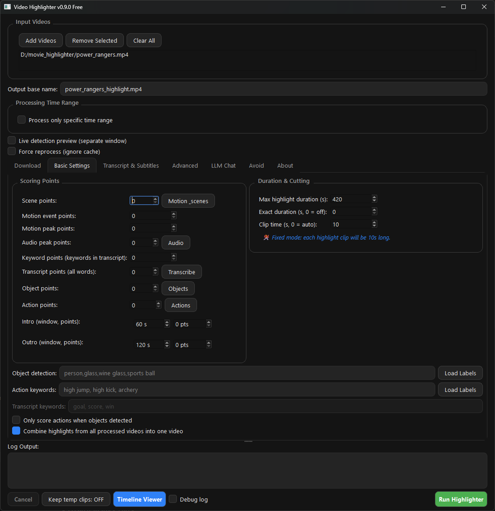
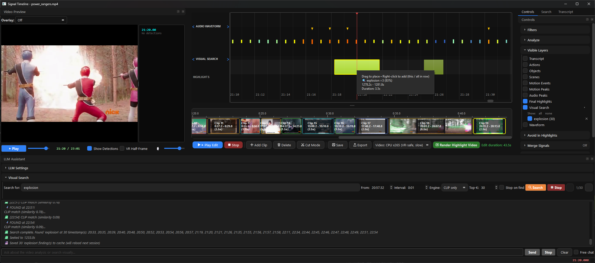
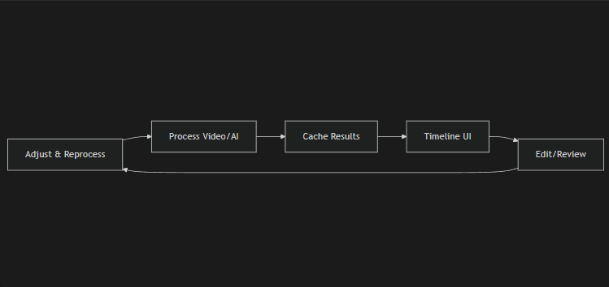
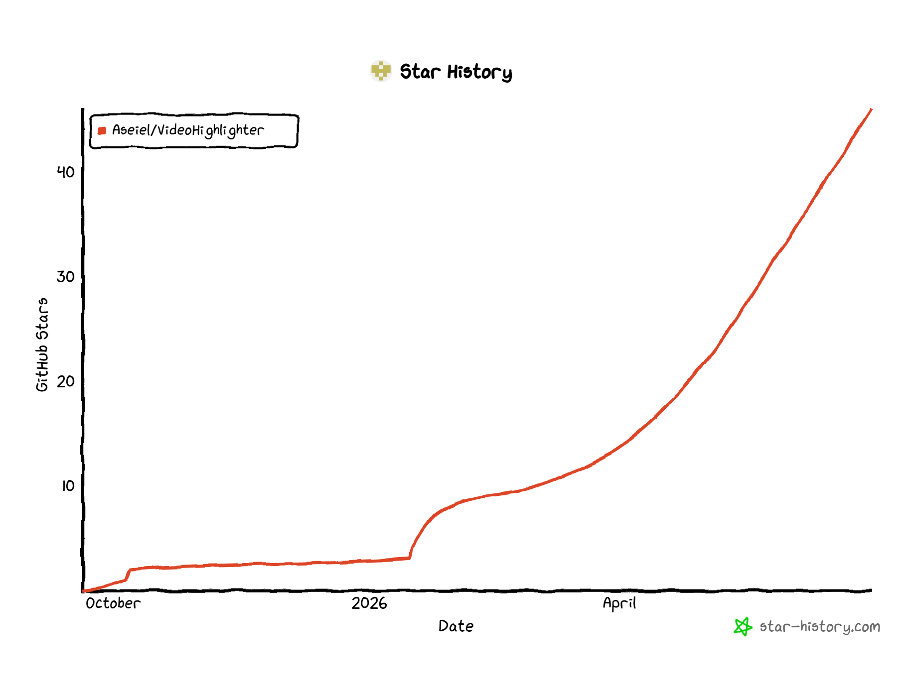

  

VideoHighlighter (Freeware)

<!-- hy-mt2-i18n:start -->
**English** | [中文](./README_zh-CN.md) | [日本語](./README_ja.md) | [Español](./README_es.md)
<!-- hy-mt2-i18n:end -->

**Find and explain the moments that matter in footage you won't upload — then export a cut, on your machine.**

A local desktop tool: drop raw video, score strong moments (scene, motion, audio, objects, actions, transcript), see *why* they scored on a signal timeline and report, then export a highlight reel and separate clips. Nothing is uploaded for analysis.

> **It's free.** To make sure you see new releases in future, please click the
> motivation button: the ⭐ at the top of the page. It's the cheapest payment we
> accept.

Features

Detects:
- Scenes using OpenCV.
- Motion peaks and scene changes.
- Objects
- Actions
- Audio peaks.

Generates transcript subtitles via OpenAI Whisper (local).
Cuts and merges top scoring segments into a highlight video, and optionally
writes each one out as a separate clip beside the reel.
Combines many clips into a single reel, with an optional music bed
(replace / mix / duck) and correct handling of rotated (phone / GoPro) footage.
Optionally penalizes blurry clips so sharp moments win.
Fully configurable: frame skip, highlight duration, keywords.

Two front ends over one engine:
- **Qt desktop GUI** (`main.py`) — the original, with the full Timeline Viewer.
- **Web app** (`frontend/` + `sidecar/`) — a Tauri v2 shell around a React UI,
  with the Python engine running behind it as a FastAPI sidecar. Adds
  folder-at-once input, the reel + music controls, and the blur gate. See
  [`frontend/README.md`](frontend/README.md). It still launches the Qt window
  for the Timeline Viewer.

## Card to film

The **Auto** tab runs the whole thing as one resumable job: find the camera
card, copy it off, find the highlights, build the reel, lay the music.

- **Ingest** — cards are found by layout, not drive letter, and GoPro's
  chapter-before-file-number naming is sorted back into recording order (the
  reason a plain listing interleaves separate takes). Copies verify before they
  land, so an interrupted transfer can't leave a short file that looks whole.
  Re-running copies nothing. Nothing is deleted from the card.
- **Script** — a YAML file saying what the film should contain, beat by beat,
  so a run can express intent instead of just "the highest-scoring seconds".
  Unknown keys are refused with a line number and a suggestion rather than
  silently ignored.
- **Music** — beats, downbeats, tempo and energy sections, on numpy and ffmpeg
  alone. Cuts can then land on the beat rather than near it.
- **Resume** — every stage records what it produced and a re-run skips whatever
  is still on disk, because the expensive middle is exactly what gets
  interrupted.

Full detail: [docs/AUTO-PIPELINE.md](docs/AUTO-PIPELINE.md).

Not sure which detector to reach for? See
[docs/DETECTION-GUIDE.md](docs/DETECTION-GUIDE.md) — what object recognition,
action recognition, CLIP search and the composition engine are each good at,
and where each one falls down.

> **Want real-time detection?** Everything above runs offline, after the fact.
> [VideoHighlighter Pro](#pro-edition) adds live object and action overlays
> during playback, teach-by-example categories, open-vocabulary detection and
> counter detection. [See what's different →](#pro-edition)

## Preview

## Timeline Viewer

## Demo

https://github.com/user-attachments/assets/5c85af94-9228-4537-926a-1ed7a91fa5ee

## Workflow Stages

## Why these moments

Every run writes a report next to the highlight — one self-contained HTML file
you can open or email. Nothing is fetched when it loads; the thumbnails are
embedded.

It is not a summary. It is the arithmetic: for each moment kept, the per-signal
point breakdown, which objects and actions fired, the confidence tier each one
landed in, and whether the multi-signal boost applied. Around that sit the clips
in cut order, the video in chapters, the moments that scored well and still did
not make it, and the exact settings the run used.

Two sections earn it its keep:

- **Said here, measured nowhere** — lines from the transcript that no class or
  event this run produced shares a word with. The report quotes them and states
  that it has no measurement for them, rather than quietly scoring them as
  though it did.
- **What to try next** — worked out from that run's own numbers, each point
  backed by the figures shown beside it rather than by a guess about what you
  meant. It reads like this:

  > **The highlight came out shorter than you asked for.** You asked for up to
  > 46s and got 30s. In MAX mode the cut stops when it runs out of moments that
  > scored anything at all — not when it runs out of budget. *Try:* lower the
  > detector thresholds so more moments score, give another signal a weight, or
  > accept the shorter cut — padding it means including moments nothing was
  > detected in.

Explanation is never a paid feature. The report, the findings and the advisor
are identical in both editions. A cloud tool gives you a button and a result you
cannot interrogate; answering "why", locally, is what this is instead.

## Composition rules

The detectors report what is on screen. A composition rule says what a
*combination* of those readings means for your footage, and scores it.

A rule names the signals it tests and the window it tests them over. Available
signals include the per-second audio and vocal measurements (`audio_level`,
`vocal_effort`, `vocal_density`), scene and motion events, and any class the
detectors produced. A match becomes an event under a name you choose, and that
name then appears in the report like any other signal.

Rules live in `composition_rules.yaml` beside the executable, or in the project
root when running from source. There is no built-in set and the file is not
tracked by git: the vocabulary is yours, and the engine is skipped entirely when
the file is absent.

They run on **every** pass, over whatever detections are already to hand — a
rule is a reading of boxes that already exist, not a second detection. So
editing one and re-running costs milliseconds and never invalidates the cache.
The loop is: change a threshold, re-run, read the report, change it again.

## Pro edition

This edition already includes live face detection, VR side-by-side playback and
rendering, offline analysis, CLIP search, the composition engine, and the
training scripts.

[VideoHighlighter Pro](https://aseiel.github.io/VideoHighlighter-site/) adds:

- **Live object and action overlays** — real-time detection during playback,
  including on side-by-side VR footage.
- **Teach a category by pointing** — draw a box around anything, name it, and
  it is scored live from then on. No dataset, no training run.
- **Find more like this** — pick a region in one frame and search the whole
  video for it.
- **Open-vocabulary detection** — type a plain word and find it, with no
  trained model for it.
- **Counter / scoreboard detection** — if the footage has an on-screen counter,
  every tick proves an event, so Pro can show which real moments the detector
  missed.

This edition remains free and AGPL-3.0 licensed.

## Installation

### Windows (recommended)
1. **One-click:** download [`VideoHighlighter-Windows-Setup.zip`](https://github.com/Aseiel/VideoHighlighter/releases/latest/download/VideoHighlighter-Windows-Setup.zip) from [Releases](https://github.com/Aseiel/VideoHighlighter/releases), extract it, and double-click **`Install-VideoHighlighter.bat`**. It downloads both archive parts and unpacks them (~4 GB download).
2. **Manual:** download **both** `VideoHighlighter-Windows-*.7z.001` and `.7z.002` into the same folder, then extract the `.001` file with [7-Zip](https://www.7-zip.org/).

No Python or dependencies required — run `VideoHighlighter.exe` inside the extracted folder.

### macOS
**Not a supported product download.** The prebuilt app we sell and support is
Windows-only. You can try building from source on macOS if you know the stack;
we do not ship or support a Mac release yet.

### Linux / building from source
1. **Python & FFmpeg**
   FFmpeg must be installed and available in your system PATH.

## Usage
- **Windows:** run `VideoHighlighter.exe` from the extracted build.
- **From source (Linux / advanced):** `python main.py`

Footage, transcripts, and local models stay on disk. Analysis does not require
an API key for the basic pipeline.

## Discord
VideoHighlighter occasionally has feelings about your footage. When it does:
[Join the Discord](https://discord.gg/cUPJqPAMmm) and yell in #support, I'm usually around.

## Notes

OpenAI Whisper is MIT licensed — freely usable.

Google Translate API is optional. If using unofficial libraries (googletrans), no API key is needed, but results may break if Google changes endpoints.

This project does not include any paid API keys. Users must provide their own if using official services.

## License

Copyright (C) 2026 Przemysław Kreft and Meric Donmezer.

This repository is released under the GNU Affero General Public License v3.0 (AGPLv3). You are free to use, modify, and distribute the code, provided that any modified versions, including those offered over a network, make their complete source code available under the same license. The full text is in [LICENSE](LICENSE); the copyright notice is in [COPYRIGHT](COPYRIGHT).

Contributors keep copyright in their own work — see [CONTRIBUTING.md](CONTRIBUTING.md) and [CLA.md](CLA.md). VideoHighlighter is also offered under a separate commercial license by the copyright holders.

## Project Background

This project started as a personal tool to automatically generate subtitles for videos, for my young 7 years old son. Over time, it evolved into a highlights generator for movies, sports, and personal videos.

The primary goal remains practical: speed up video analysis, generate highlights you can explain, and create accessible subtitles automatically — without uploading footage you would rather keep local.

