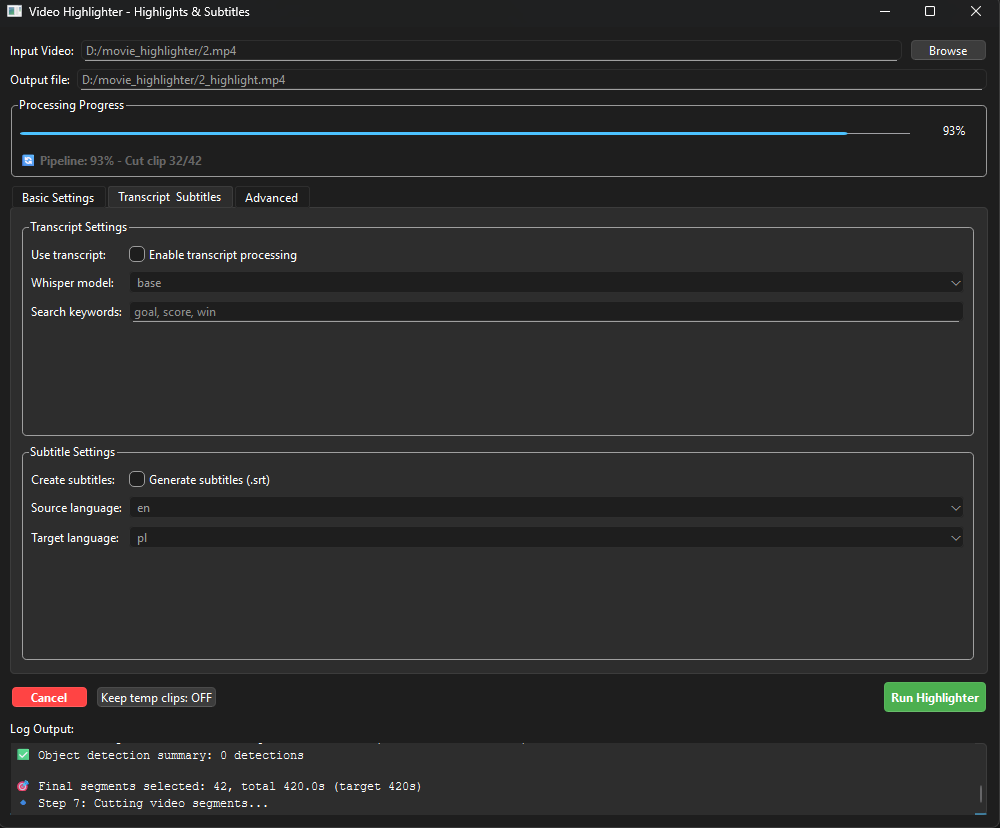

VideoHighlighter (Freeware)

A Python tool to automatically generate highlight clips from videos using scene detection, motion detection, audio peaks, object detection, action recognition, and transcript analysis.

Features

Detects:
- Scenes using OpenCV.
- Motion peaks and scene changes.
- Objects
- Actions
- Audio peaks.

Generates transcript subtitles via OpenAI Whisper.
Cuts and merges top scoring segments into a highlight video.
Fully configurable: frame skip, highlight duration, keywords.
Optional GUI for easy interaction.

## Preview

Setup & Installation
1. Python & FFmpeg
FFmpeg must be installed and available in your system PATH.

Check FFmpeg installation:
ffmpeg -version

2. Install Python Dependencies
pip install -r requirements.txt

Dependencies include:
numpy, torch, opencv-python, tqdm, ffmpeg-python, openai-whisper, googletrans, openvino-dev
For YOLO object detection: ultralytics
For GUI: PySide6

3. Download Models
The code will automatically download YOLO models on first run.

Intel Action Recognition
Download manually and place in models/intel_action/:

Encoder:
https://storage.openvinotoolkit.org/repositories/open_model_zoo/2023.0/models_bin/1/action-recognition-0001/action-recognition-0001-encoder/FP32/
move to VideoHighlighter/models/intel_action/encoder/FP32/
Decoder:
https://storage.openvinotoolkit.org/repositories/open_model_zoo/2023.0/models_bin/1/action-recognition-0001/action-recognition-0001-decoder/FP32
move to VideoHighlighter/models/intel_action/decoder/FP32/

Usage
python main.py 

Notes

OpenAI Whisper is MIT licensed — freely usable.

Google Translate API is optional. If using unofficial libraries (googletrans), no API key is needed, but results may break if Google changes endpoints.

This project does not include any paid API keys. Users must provide their own if using official services.

License

This repository is released under the MIT License. You are free to use, modify, and distribute the code.

Project Background

This project started as a personal tool to automatically generate subtitles for videos, for my young 7 years old son. Over time, it evolved into a highlights generator for movies, sports, and personal videos.

⚠️ Note: Development may be slow, minimal or none in the future, due to time constraints and family responsibilities. Contributions and improvements from the community are welcome!

The primary goal remains practical: speed up video analysis, generate highlights, and create accessible subtitles automatically.
