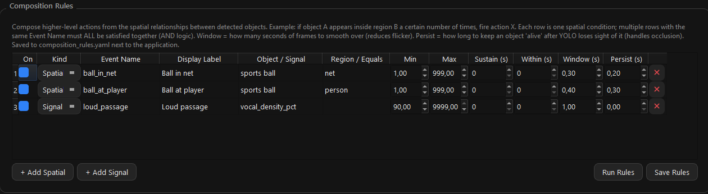
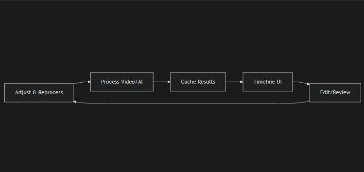

# Choosing a detector

VideoHighlighter ships four detection engines. They are not ranked — each
answers a different *kind* of question, and picking the wrong one wastes hours
before you find out. This guide is about matching the question to the engine.

Everything here describes mechanisms. What you point them at is your business:
queries and rules are supplied at runtime and stored as your own data, never in
the application.

---

## The one-minute version

| Your question | Engine | Training needed? |
|---|---|---|
| "Where is this thing in the frame?" — a bounded object you can point at | **Object recognition** | Yes, unless it's one of the 80 COCO classes |
| "What is happening here?" — motion, an activity unfolding over time | **Action recognition** | No: type the action. Training helps where its name does not |
| "Find where the video looks like X" — scene, setting, framing, mood | **CLIP search** | No |
| "Find where several of the above hold at once" | **Composition engine** | No — it combines what the others produce |

If you are new: start with CLIP search to explore what's in the video, then
reach for a trained detector only for the handful of things you need to be
fast and reliable about.

---

## 1. Object recognition (YOLOX)

**Answers:** where is this thing, right now, in this frame.

**Speed:** real time.

**Vocabulary:** the 80 COCO classes out of the box, plus any model you train
in the app (the Train tab) or import as `.onnx` / OpenVINO `.xml`. The stock
models download on first use into `models/yolox/`. Runs on OpenVINO; on an AMD
or NVIDIA card the stock detector runs through ONNX Runtime's DirectML
provider instead.

**Strengths.** Precise boxes, stable confidence, cheap enough to run over a
whole video. Because it emits boxes it can *count*, and counting is exact:
"how many" is the number of boxes, "none" is zero boxes.

**Limits.** It only knows what it was trained on. If your subject isn't in
COCO, you are training a model — see "Training your own class" below.

**Use it when** the thing matters enough to justify labelling, or you need it
at frame rate.

---

## 2. Action recognition

**Answers:** what kind of motion is happening across this stretch of time.

**Speed:** windowed — 5-second windows every 2.5 seconds, four frames each.
About 12 s for a 23-minute video on an Arc A750.

**Model:** SigLIP2 (Apache-2.0), downloaded once from Advanced → Action
Recognition. Two ways to use it:

- **By name, no training.** Type any action. The 700 Kinetics-700 names are
  suggested as you type, and a blank field means any of them. Every listed name
  competes in every window, so an action counts only when the window looks more
  like it than like the other 700 things people do. Read off the whole frame.
- **By example.** Train a small model on folders of your own clips (Train →
  Actions, or Train → From videos). When one is installed it is used instead,
  on crops around the people in each window.

**Frames per window** (Advanced → Action Recognition) sets how many frames of
each window are read for actions by name: **4, faster** (the default), or
**8, about 1.5× slower and stricter**: on the one video measured it found
nothing 4 missed and dropped a few windows that only looked like the action.
The numbers are in `docs/plans/2026-10-07-action-frames.md`. A trained model
always reads its own number of frames.

**Strengths.** It looks across several seconds, so it can tell actions that a
single frame cannot, and by name it covers far more than any fixed list did.

**Limits — read this one before you build a dataset.** A trained model is fed
crops around people, not the whole frame. Global spatial layout is cropped
away before the model gets a vote.

The practical consequence: **it cannot separate classes that differ only by
*where* something happens.** If two of your categories involve the same motion
in different places, the model has no access to the information that
distinguishes them, and training them as separate classes will just produce a
confused model and a smaller dataset per class.

The fix is to merge them into one class and let the composition engine split
them by location afterwards. See "Primitives, not categories".

**Use it when** the thing you want is defined by movement rather than
appearance.

---

## 3. CLIP search

CLIP embeds a whole image into a vector, then compares it against a phrase you
type. Everything it is good at follows from that, and so does everything it is
bad at.

**The cost model is what makes CLIP special.** It embeds each frame *once*,
into an index. After that, unlimited queries are nearly free. Every other
engine here charges you per query, per frame.

**Use it for** setting, scene type, framing, time of day, general mood — things
that describe the picture as a whole.

**Limits.** CLIP scores *scenes*, not objects. If your target is a few percent
of the frame, the embedding is dominated by everything around it, and you are
effectively asking "does this look like the *scene* where that appears", not
"is it here".

So: **large or scene-defining → works well. Small discrete object → use the
detector instead.**

**On the score.** Raw CLIP similarity has no meaningful zero — everything lands
in a narrow band. The prefilter compares your query against generic negative
prompts so the result is a calibrated softmax rather than a bare cosine, which
is what makes a threshold transferable between videos. Judge results by
*ranking* first; treat the absolute number as secondary.

---

## 4. The composition engine

The other three engines produce detections. This one turns detections into
*meaning*, using rules you write in `composition_rules.yaml` (it lives in your
user data folder, never in the app).

A rule counts how many boxes of one class have their centre inside a box of
another class, and fires when the counts hold steady over a short window:

```yaml
events:
  - name: held_object
    label: Held object
    window_secs: 0.75      # majority-vote smoothing
    persist_secs: 0.5      # keep a box alive this long after it disappears
    rules:
      - {source: handle, region: tool, min_count: 1}
```

`min_count` / `max_count` give you counting *and* absence — `max_count: 0`
means "none of these inside that". Source boxes are consumed across rules, so
two rules each needing one source genuinely require two distinct objects.

### An event the models have no word for

This is what the engine is really for. Action recognition by name judges how
a whole window looks, so an event defined by *where* things are relative to
each other is not something a name can pin down. A rule is not limited that
way. It describes a *relation* between
detections — one class inside another, counted, holding steady over a window —
so the event is whatever that relation means in your footage, under the name
you gave it.

A goal, for instance, is a ball whose centre is inside the net:

```yaml
events:
  - name: ball_in_net
    label: Ball in net
    window_secs: 0.3        # it is only in there briefly — smooth less
    persist_secs: 0.2
    rules:
      - {source: sports ball, region: net, min_count: 1}
```

The same rules in the app, where they are edited and run:



`sports ball` is one of the 80 classes the stock detector already knows. The net
is not, so that single class is what you label and train — one primitive,
reusable, rather than a "goal" class the network would have to infer from pixels
that do not contain the distinction. The rule supplies the meaning. See
[Primitives, not categories](#primitives-not-categories) below.

### Confidence follows the weakest detection

A composed event is only as sure as the weakest detection it matched, so it
carries *detector* confidence rather than a classifier's guess at a class it was
never taught. In the rule above, a ball found at 0.91 inside a net found at 0.87
scores 0.87 — and 80–100% is the ordinary case, for moments an action label
would score far lower and often name wrongly.

### Two settings worth understanding

**`persist_secs`** keeps a class alive after its last detection. Raise it when
a region gets occluded at the exact moment you need it. But raise it only on
rules that need it: a *moving* object whose box drifts far enough will fail the
overlap match and be tracked as a second instance, inflating your counts and
corrupting `min_count` rules.

**`window_secs`** is smoothing, not timing. Note what this means: every rule is
a *state* test, evaluated per frame. It answers "is this true now", not "did
this just start". For something that appears and then stays on screen, a rule
will keep firing for as long as it remains visible.

### Not yet: how far inside

A rule tests whether the source box's **centre** falls inside the region box.
There is no "how deep" threshold, so depth is decided when you label: draw the
region around the mouth of something and touching it counts, draw it around the
space behind and only fully entering does.

That is enough for most things and wrong for some. A box is axis-aligned and a
net is a volume seen in perspective, so the fraction of a ball inside the
*box* is not the fraction inside the *net*, and no threshold on box overlap
would fix it.

Doing it properly needs contours rather than boxes:

- a segmentation model for the region class, so the cache carries a mask or a
  polygon instead of four numbers;
- a depth measure over that contour — how far past the front edge the source's
  centre sits, or what fraction of its area the mask contains;
- a rule option for it, defaulting to today's centre test so no existing rule
  changes meaning.

The first of those is the real cost: it is a different export and a wider cache
format, and every rule that does not ask for depth would still pay to store
them. Worth doing when something actually needs to distinguish "on the line"
from "over it".

### Where rules live, and what they cost

Rules live in `composition_rules.yaml` in your user data folder — beside the
executable on Windows, `~/Library/Application Support/VideoHighlighter` on
macOS, the project root when running from source. Nothing ships with a rule set,
and the file is gitignored, so the events you define stay on your machine. With
no file present the engine is skipped entirely.

Composed events get their own rows on the timeline, directly under the waveform,
one row per rule that actually fired, filterable separately from objects and
actions.

They run on **every** pass, over whatever detections are already to hand — a
rule is a reading of boxes that already exist, not a second detection. So
editing one and re-running costs milliseconds and never invalidates the cache.
The loop is: change a threshold, re-run, read the report, change it again.



That cache is what makes the loop cheap — the detection pass is the expensive
part, and adjusting scoring, rules or thresholds re-reads it rather than
redoing it.

---

## Primitives, not categories

The single most useful principle in this document.

When you have several categories that share the same appearance and differ only
by *where* something is, **do not train them as separate classes.** You will be
asking the network to learn a distinction its input doesn't contain, you will
split your training data N ways, and every new category will mean relabelling.

Instead:

1. Train **one** class for the thing itself — the primitive.
2. Get the location from something you already have (another trained class, a
   detector you already run).
3. Write one composition rule per category.

Adding a category then costs a few lines of YAML instead of a training run.
This also means a small number of well-trained primitives goes a very long way:
three good classes can express a dozen composed events.

---

## Training your own class

When no engine above can see your subject, you train a detector. Briefly:

- **Box the region, not the speck.** Small objects are the hardest case. A
  larger, stable region containing the thing beats a tight box around a few
  pixels, tracks better between frames, and works with the composition engine's
  centre-inside test.
- **Hard negatives matter more than more positives.** Include frames
  containing whatever your detector will confuse for the target, with *no* box
  on them. Budget roughly a third of your set for this. Verify your conversion
  step keeps zero-annotation frames — many drop them, and those are the ones
  doing the work.
- **Diversity beats volume.** 2000 instances from 300 sources beats 10000 from
  20. Adjacent video frames are near-duplicates; sample at least a second apart.
- **Write your labelling rule down first.** Inconsistency — the same appearance
  boxed in half your frames and not the other half — caps accuracy harder than
  dataset size.
- **Label the hard state too.** If a region changes appearance during the event
  you care about, and you only ever labelled it clean, your detector will drop
  out at exactly the wrong moment.
- **If two architectures score the same, you are data-limited, not
  model-limited.** Stop swapping backbones; fix the data.

**On licensing:** detection and training here are YOLOX (Apache-2.0), and the
app deliberately depends on no AGPL detector. That is what lets a model you
train be shared and used by anyone, in any build: a model trained with an AGPL
toolkit inherits that licence, and the app's model packages refuse a detector
whose output layout is not YOLOX's. When you share a model, share the model —
never the frames, clips or audio it was trained on.

---

## Cost at a glance

| Engine | Per-frame cost | Repeat queries |
|---|---|---|
| Object recognition | real time | re-run required |
| Action recognition | windowed, fast | re-run required |
| CLIP index | fast, **once** | nearly free, unlimited |
| Composition engine | negligible | instant — it reads cached detections |

The practical pattern for anything expensive: build the CLIP index first, use
it to narrow down where to look, then run the costly engine only on those
stretches.

---

## Command-line helpers

Both CLIP entry points have a standalone CLI, useful for testing a query before
committing to a full run.

CLIP index — `--query` is repeatable, and every query after the first is nearly
free because they all score against the same index. This is the cost model from
the table above, made visible:

```bash
python -m llm.clip_index --video "v.mp4" --interval 2 --query "an outdoor scene" --query "a close-up" --topk 10
```

Pass `--cache` to reuse an index you already built instead of re-embedding.

Single-query ranking without keeping an index:

```bash
python -m llm.clip_prefilter --video "v.mp4" --query "an outdoor scene" --topk 20
```

Add `--help` to either for the full option list.

---

## Quick troubleshooting

| Symptom | Likely cause |
|---|---|
| CLIP ranks obviously wrong frames highly | Target too small in frame — CLIP sees the scene, not the object. Use the detector. |
| CLIP scores look uniformly low | Normal. Judge by ranking, not by the absolute number. |
| A composition rule never fires | One of its classes isn't being detected. Check each class fires on its own before combining. |
| A rule fires far longer than the event | Rules test state, not onset — it stays true while the thing is visible. |
| Trained model confuses two categories | They probably differ only by location. Merge and split with a rule. |
| No actions found | The action model is not installed (Advanced → Action Recognition offers it), or no window matched a typed action clearly enough. Try another wording, or leave the field blank to see what it does find. |
